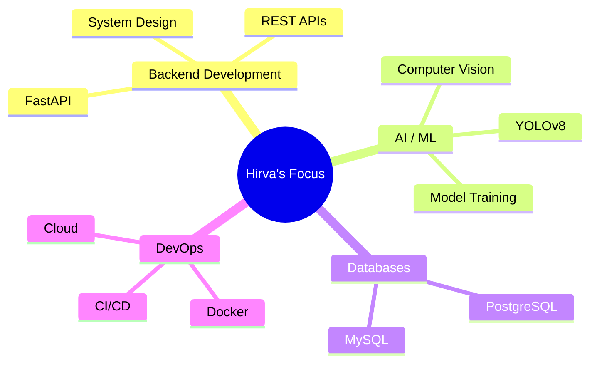

<h1 align="center">Hey there, I'm Hirva Kansara! 👋</h1>

<p align="center">
  
</p>

<p align="center">
  
  
</p>

---

## About Me

```text
const hirvaKansara = {
    location: "Ahmedabad, Gujarat, India 📍",
    timezone: "IST (UTC +5:30) 🌏",
    education: "B.Tech in Computer Science & Business Systems (CSBS) @ Pandit Deendayal Energy University, Gandhinagar",
    graduation: "Expected 2027",
    currentlyLearning: ["System Design", "ML & AI", "Cloud", "DSA", "Docker & CI/CD", "Scalable Backend Development"],
    askMeAbout: ["FastAPI", "Computer Vision", "Machine Learning", "PostgreSQL", "Backend Development", "System Design"],
    highlights: [
        "Secured 45th Rank in DDCET 2025 (Gujarat State) 🏆",
        "Built multiple AI & Backend projects using FastAPI, PostgreSQL and YOLOv8 🤖",
        "Maintained a CGPA above 9.5 throughout diploma in engineering 🎓"
    ],
    funFact: "I turn real-world problems into AI-powered applications and love learning through hackathons! ⚡"
};
```

## 💼 Professional Experience

| **🤖 AI & Machine Learning Intern** |
|---|
| *Techify Solutions* \| 2 Months |
| Worked on real-world AI and Machine Learning applications, contributing to the **GoMoto** project. Developed backend APIs, performed data preprocessing, trained ML models, and collaborated on production-level solutions using Python and modern AI frameworks. |
| `Data Preprocessing` `Model Training & Evaluation` `Python` `Pandas` `Scikit-learn` `Practical ML Workflows` |

## 🛠️ Tech Arsenal

### Languages


### Backend


### AI / ML


### Databases


### Tools


## 📊 GitHub Analytics

<p align="center">
  
  
</p>

<p align="center">
  
</p>

<p align="center">
  
</p>

## 🚀 Featured Projects

- 🍽️ **[NutriLens – AI Food Calorie Prediction](https://github.com/hirvak/NutriLens)**
  AI-powered calorie estimation system using custom-trained YOLOv8 models with nutrition tracking, streaks, and manual food entry.
  **Tech Stack:** `FastAPI` `React` `PostgreSQL` `YOLOv8` `Computer Vision`

- 🎫 **[Ticket Management System](https://github.com/hirvak/Ticket-Management-System)**
  Role-based ticket management platform with authentication, admin dashboard, search, filtering, and pagination.
  **Tech Stack:** `FastAPI` `React` `TypeScript` `PostgreSQL` `JWT`

- 🚍 **[TransitOps](https://github.com/hirvak/TransitOps)**
  Smart transport operations platform for managing vehicles, drivers, trips, fuel logs, maintenance, and expenses.
  **Tech Stack:** `FastAPI` `PostgreSQL` `JWT` `Alembic`

<p align="center">
  <a href="https://github.com/hirvak?tab=repositories">
    
  </a>
</p>

## 🎯 Current Focus



## 🌟 Let's Connect!

<p align="center">
  <a href="https://linkedin.com/in/hirva-kansara-b901392b2">
    
  </a>
  <a href="https://github.com/hirvak">
    
  </a>
</p>

<p align="center">
  
</p>

---

<p align="center">
  
</p>

<h3 align="center">💫 "Learning never stops and neither does innovation!" 💫</h3>


